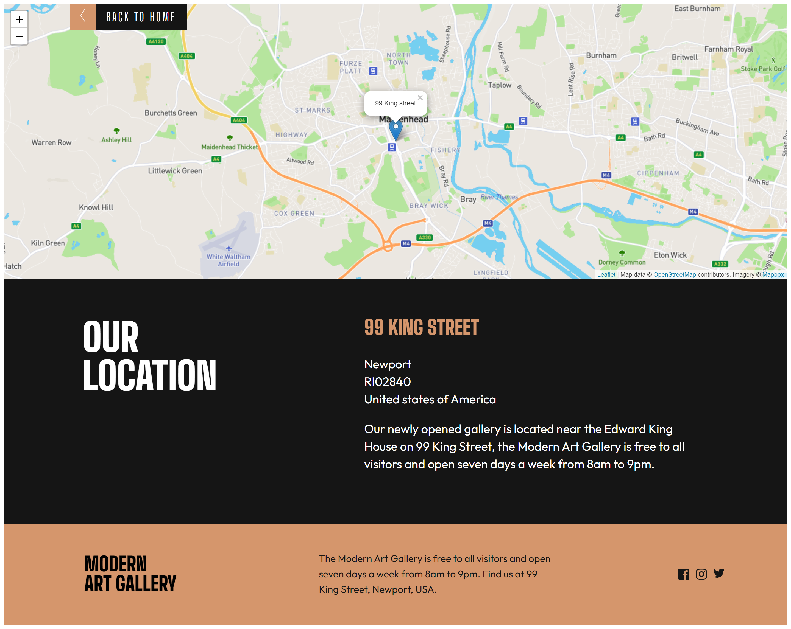
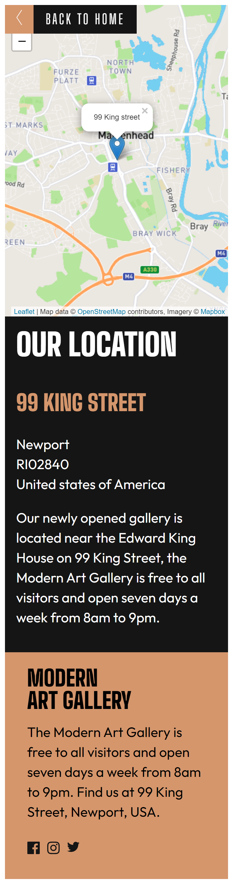
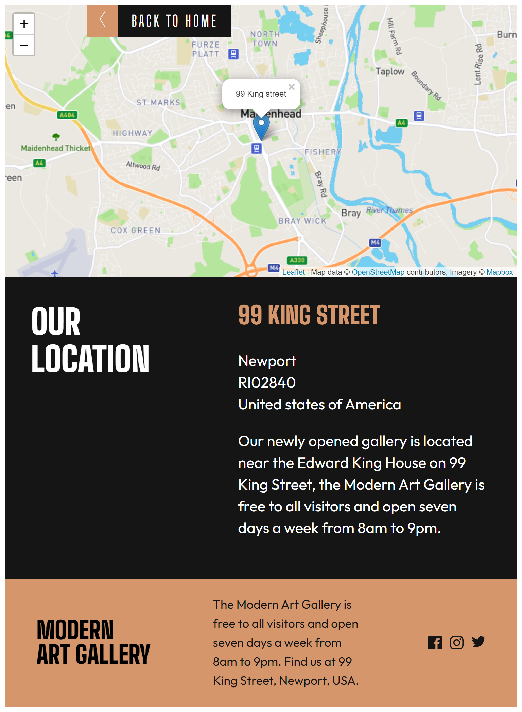

# Frontend Mentor - Art gallery website solution

This is a solution to the [Art gallery website challenge on Frontend Mentor](https://www.frontendmentor.io/challenges/art-gallery-website-yVdrZlxyA). Frontend Mentor challenges help you improve your coding skills by building realistic projects. 

## Table of contents

- [Overview](#overview)
  - [The challenge](#the-challenge)
  - [Screenshot](#screenshot)
  - [Links](#links)
- [My process](#my-process)
  - [Built with](#built-with)
  - [What I learned](#what-i-learned)
  - [Continued development](#continued-development)
  - [Useful resources](#useful-resources)
- [Author](#author)

**Note: Delete this note and update the table of contents based on what sections you keep.**

## Overview

### The challenge

Users should be able to:

- View the optimal layout for the site depending on their device's screen size

### Screenshot

### Links

- Solution URL: [Add solution URL here](https://your-solution-url.com)
- Live Site URL: [art-gallery-frontend-mentor-faruking.vercel.app/]

## My process
I used a layout-first process that involved creating how the layout should look like before inserting contents one after the other and styling them.
### Built with

- HTML
- CSS
- CSS Grid

### What I learned
I learnt "grid-template auto row" ,flexbox, how to use leafletmap etc

### Continued development

Would like to continue learning layouts and how to style a character with different colors

### Useful resources

- [leaflet map](https://leafletjs.com/) - Used this to create an interactive map
- [stackoverfow](https://stackoverflow.com) - Used this to solve some of the minor problems i was having 

## Author

- Frontend Mentor - [faruking2](https://www.frontendmentor.io/profile/faruking2)
- Twitter - [faruking2](https://www.twitter.com/faruking2)
